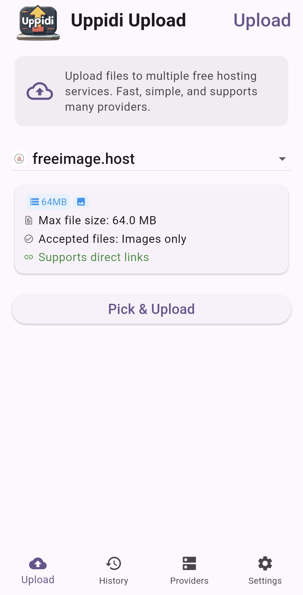
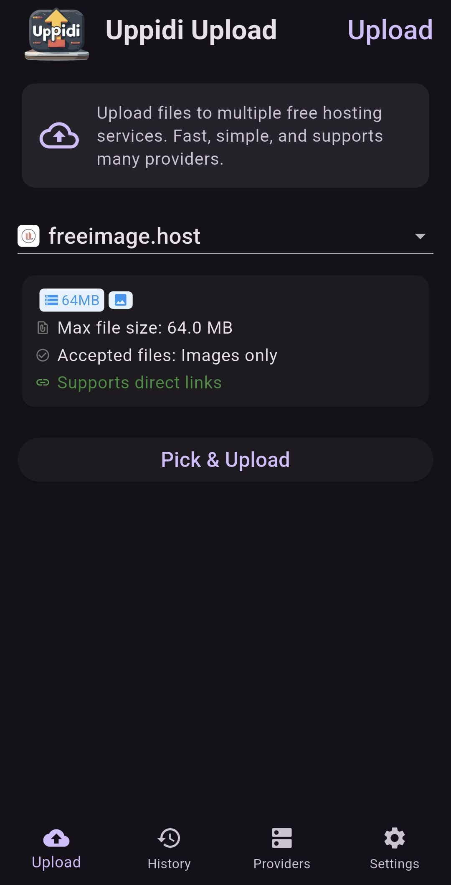
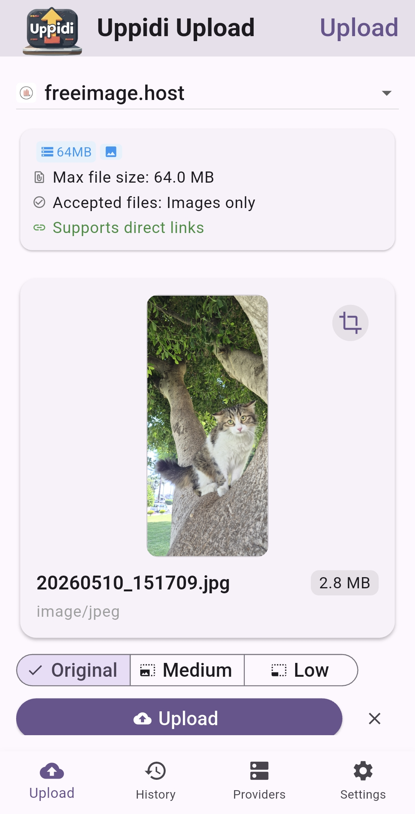
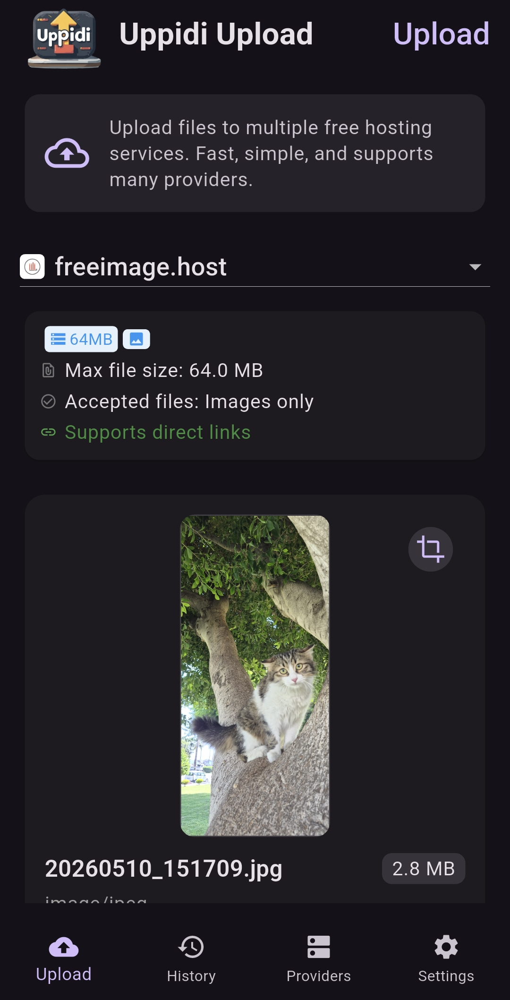
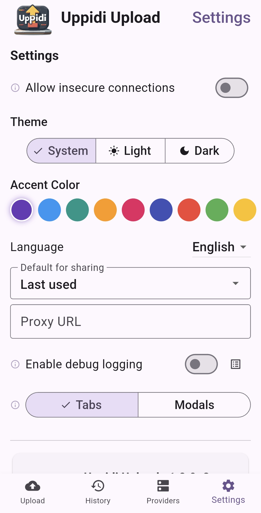
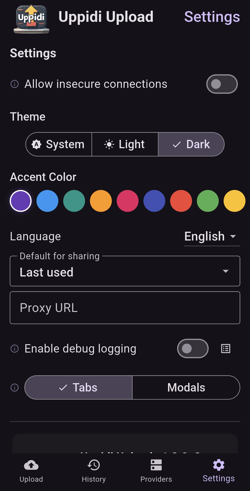

# Uppidi Upload

Uppidi Upload is an open source, cross-platform application for uploading media and files to public and private providers. Upload images, videos, and other files from your phone, tablet, or desktop and share the URL anywhere, including IRC (backed by a public provider of your choice for the file itself).

## Screenshots

| Light | Dark |
|---|---|
|  |  |
|  |  |
|  |  |

## Features

- **13 providers** — public services and your own authenticated infrastructure
- **Desktop drag & drop** — drag files from your file manager, paste from clipboard, hover overlay feedback
- **Message templates** — global template with `{url}`, `{filename}`, `{filesize}`, editable per upload
- **History relay** — re-share any past upload to a Matterbridge gateway
- **Cross-platform** — Android, Linux, Windows, macOS

## Supported Hosting Providers

### Public

- Catbox
- FileDitch
- Frisk (1 day expiry)
- Litterbox (temporary/expiring files)
- Uguu.se
- Tmpfile.link
- FreeImage.host
- TempSH
- HttpBin.org (for testing)

### Your Own Infrastructure

- **Telegram Bot** — upload files as documents or images with captions via your own bot
- **Zulip** — send to channels or direct messages, API-fetched user and stream dropdowns
- **CustomUguu** — self-hosted Uguu-compatible endpoint
- **Matterbridge** — relay file URLs through a Matterbridge gateway to IRC, Discord, Slack, Matrix, Telegram, and more. Pair with an upload provider for text-only protocols.

## Supported Platforms

- Android phones and tablets
- Linux desktops (tarball, AppImage, Flatpak)
- Windows
- macOS

On mobile, upload from your gallery or any file picker. On desktop, drag files from your file manager onto the window, paste from clipboard, or use the file picker. Share files to Uppidi from other apps.

> macOS is supported via manual CI builds. iOS has a CI workflow but requires Xcode. Pre-built binaries are not distributed for Apple platforms yet.

## Getting Started

1. Download the latest build from [GitHub Releases](https://github.com/xpufx/uppidi-upload/releases) for your platform.
2. Open Uppidi and pick a provider from the list.
3. For public services, no setup needed — just select and upload.
4. For your own infrastructure (Telegram, Zulip, CustomUguu, Matterbridge), tap the wrench icon to configure your server URL, API token, and other settings.
5. Select or drag a file, optionally write a share message with your template variables, and upload.
6. Copy the resulting link or share it directly to a Matterbridge gateway.

### Building from Source

See [BUILDING.md](BUILDING.md) for instructions on building Uppidi from source for Android, Linux, Windows, and macOS.

## Desktop Features

- **Drag & drop** — drop files from your file manager onto the upload screen. Works on Linux, macOS, and Windows.
- **Clipboard paste** — paste images from your clipboard with the paste button next to "Pick & Upload".
- **Hover overlay** — visual feedback when dragging files over the window.

## Message Templates

Configure a global share message template in **Settings**. Variables are resolved automatically:

- `{url}` — the uploaded file's public URL
- `{filename}` — the original file name
- `{filesize}` — human-readable file size

The template is pre-filled on every upload and can be edited before sending. Supported by Telegram, Zulip, and Matterbridge providers.

## Upload History & Relay

Uppidi keeps a record of your recent uploads — file name, service used, expiry duration, and the link. You can:

- Copy a link from history anytime
- **Share via Matterbridge** — select any past upload and post its URL to a Matterbridge gateway (IRC, Discord, Slack, etc.)

## Language Support

English, Italian, Turkish, Esperanto, and Klingon. Additional languages can be added via ARB files in `lib/l10n/`.

## Privacy

Uppidi does not store, view, or keep copies of files you upload. Your files go directly from your device to the hosting service you select. Provider credentials are stored in your system's secure keychain (FlutterSecureStorage).

## License

Uppidi Upload is released under the GNU General Public License v3 (GPLv3). See the [LICENSE](LICENSE) file for full details.

> **AI (LLM) Usage Notice:** This project is being developed with extensive AI assistance. The app is tested manually on Android and Linux.
