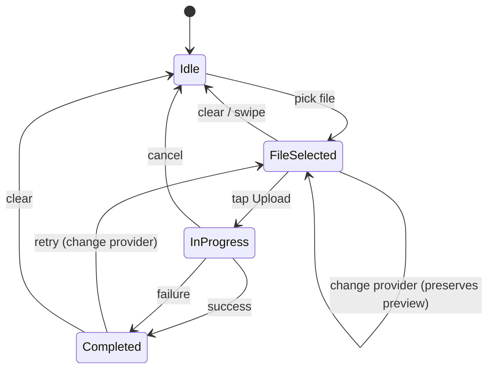
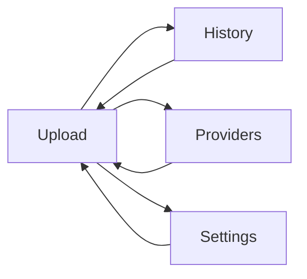
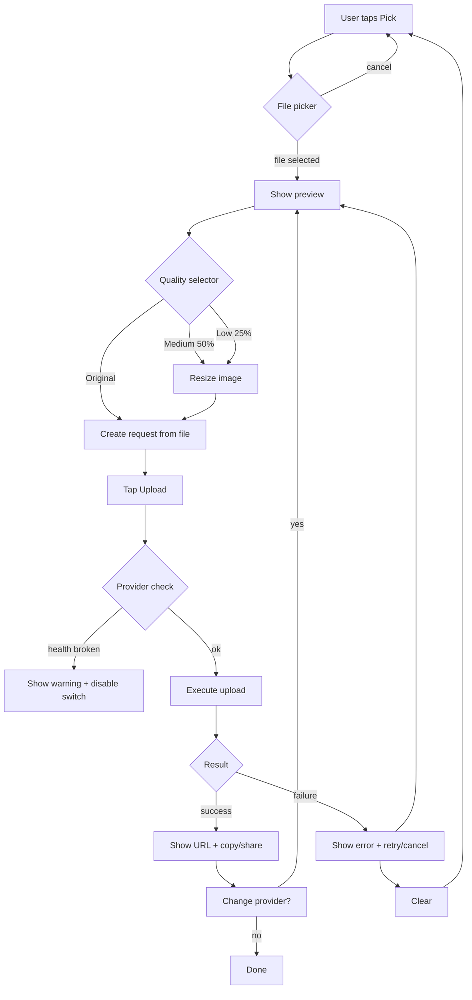
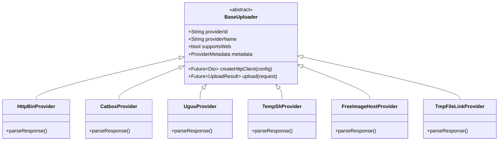
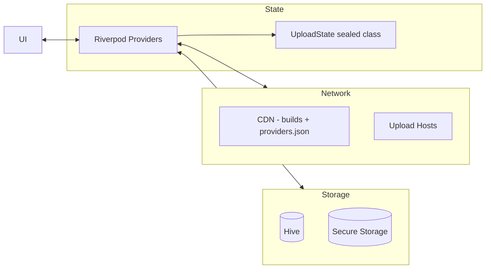
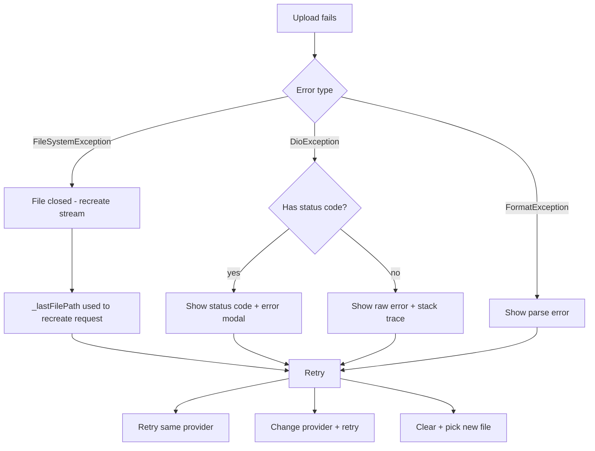

# Uppidi Upload — Architecture

## State Machine

## Navigation

## Upload Lifecycle

## Provider Plugin Interface

## Data Flow

## Error Recovery

## Key Files

| File | Role |
|------|------|
| `lib/providers/upload_provider.dart` | State machine + upload logic |
| `lib/screens/upload_screen.dart` | Main upload UI |
| `lib/core/interfaces/base_http_provider.dart` | HTTP upload base class |
| `lib/core/interfaces/uploader.dart` | Provider plugin interface |
| `lib/core/models/` | Data models (Request, Result, Record) |
| `lib/core/settings_service.dart` | Persisted settings + health manifest |
| `lib/providers/*_provider.dart` | Plugin implementations |
