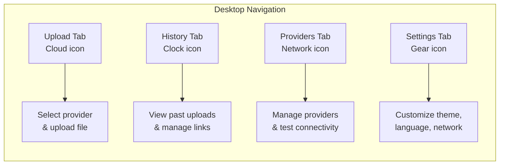
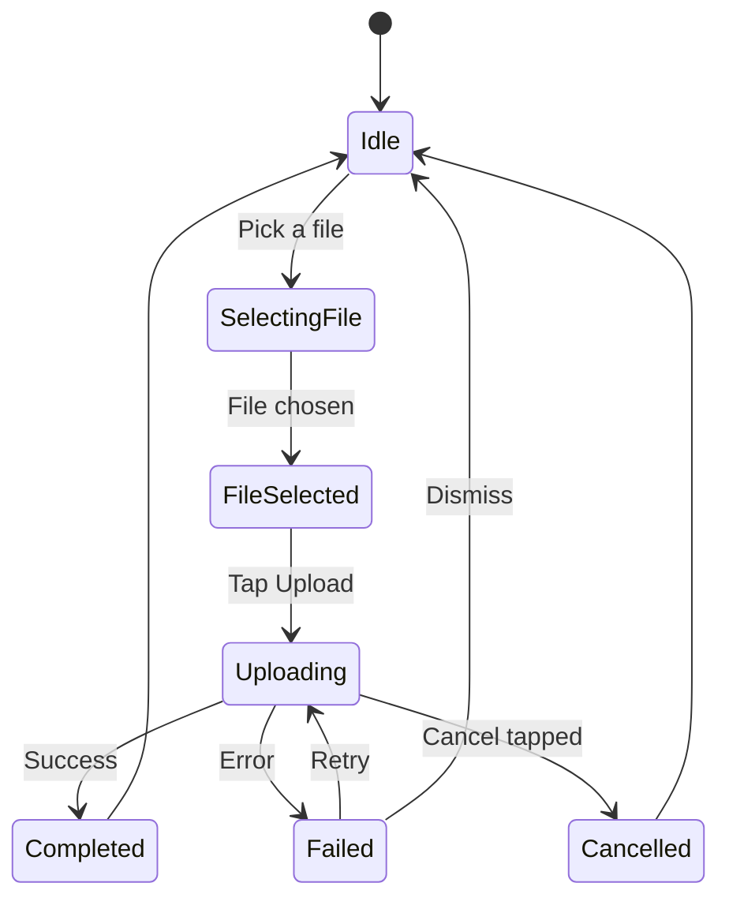
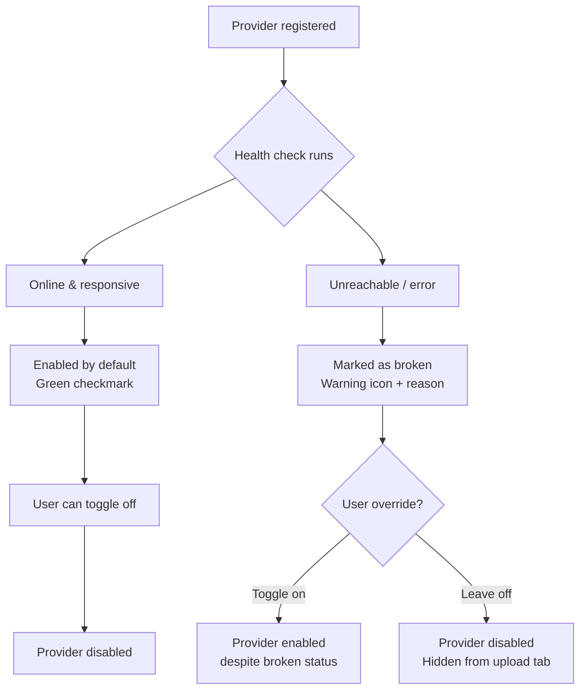

# Uppidi Upload User Manual

## 1. What is Uppidi Upload?

Uppidi Upload is a cross-platform file upload application that lets you upload images, videos, documents, and other files to multiple free and self-hosted hosting services. The app uses a modular "provider" system where each hosting service (such as Catbox, Immich, and others) connects to the app through a standardized plugin interface.

**Supported Platforms:** Android, iOS, Windows, macOS, Linux, and Web.

**Key Features:**
- Streaming uploads that handle large files without consuming excessive memory
- Cancel uploads in progress
- Upload history with link management
- Share uploaded links with templated messages
- Customizable themes and language settings
- Provider management with health checks and connectivity testing
- Image quality selector for image uploads to reduce file size
- File preview with metadata for selected files
- In-app version checking and one-click updates (Android/Linux)
- System info capture and sharing

---

### Navigation Layout (Desktop)

The app's interface is organized into four tabs, accessible from a bottom or side navigation bar:

---

## 2. How to Upload a File

### Step 1: Choose a Provider
Open the **Upload** tab (cloud upload icon) and select a provider from the dropdown menu. Each provider shows:
- Provider name and icon
- Badges indicating max file size, allowed file types, and expiry information
- On web browsers, providers that don't support web uploads are grayed out and unavailable

If you're using a web browser and select an unsupported provider, a warning bar will appear explaining the limitation.

### Step 2: Pick a File
Tap the **Pick and Upload** button to select a file from your device. On desktop platforms, you can also drag and drop a file anywhere in the app window for quick uploads.

### Step 3: Image Quality Selector (Image Files Only)
When uploading an image, you can choose the desired quality before uploading to reduce file size:
- **Original**: Full image quality, no compression
- **Medium (50%)**: Reduces file size by approximately 50% with minimal quality loss
- **Low (25%)**: Maximum file size reduction, suitable for quick sharing

This selector appears automatically when an image file is selected. The chosen quality applies only to the current upload.

### Step 4: Preview Your File
Once selected, the app displays:
- File name, size, and MIME type
- Image preview for supported image files
- Warnings if the file exceeds the provider's size limit or uses an unsupported file type

### Step 5: Start the Upload
Tap the **Upload** button to begin. The upload progress screen shows:
- Progress percentage and animated progress bar
- Upload speed (MB/s)
- Bytes sent vs. total file size
- A **Cancel** button to stop the upload at any time

---

## 3. Retry After Failure, Cancel, and Change Provider

### Cancel an Upload
Tap the red **Cancel Upload** button during an active upload. This stops the transfer and clears your current file selection.

### Retry After Failure
If an upload fails, a **Retry** button appears in the result banner. Tap it to attempt the upload again using the same file and provider. You can also tap **Cancel** to clear the failed upload and start over.

### Change Provider
Select a different provider from the dropdown menu before or after picking a file. Note: The provider dropdown is disabled during an active upload to prevent changes mid-transfer. Cancel the current upload first if you need to switch providers.

### Upload Lifecycle

---

## 4. Sharing Uploaded Links

### After a Successful Upload
When an upload completes successfully, the result banner displays your file URL with the following options:
- **Copy**: Tap the copy icon to copy the URL to your clipboard
- **Open in Browser**: Tap the open icon to view the file directly in your web browser
- **Share**: Tap the share icon to open a templated share message that automatically includes:
  - The uploaded file URL
  - Provider name
  - File name

### From Upload History
In the History tab, tap the share icon next to any successful upload entry to share its link using the same templated message format.

---

## 5. Provider Management

Access the **Providers** tab (network check icon), formerly the Test tab and positioned before the Settings tab, to manage your upload providers. This page shows all providers, both enabled and disabled.

### Provider Health & Status
- Broken providers are automatically marked with a warning icon and reason text, appearing disabled by default
- You can manually override this by toggling the enable switch next to the provider

### Provider Health Flow

### Enable/Disable Providers
Toggle the switch next to each provider to enable or disable it. Disabled providers will not appear in the Upload tab's provider dropdown.

### Test Connectivity
- Tap the **Play** arrow button next to a provider to test its connection (available for both enabled and disabled providers)
- Results display online status (green checkmark or red error icon), latency in milliseconds, or specific connection error messages
- Tap **Test All** to run connectivity checks for all providers at once

### Provider Details
Each provider entry shows:
- Provider name and icon
- Maximum file size limit
- Allowed file types
- Expiry information (if the provider automatically deletes files after a period)
- Current health status and metadata

---

## 6. Upload History

Access the **History** tab (clock icon) to view all past uploads:

### View Records
Each history entry displays:
- File name with success (green checkmark) or failure (red error) status
- Provider name used for the upload
- Upload URL (for successful uploads)
- Time since upload (e.g., "Just now", "5 minutes ago")

### Available Actions
For each history entry, you can:
- **Copy URL**: Tap the copy icon to copy the link to your clipboard
- **Open in Browser**: Tap the open icon to view the uploaded file
- **Share**: Tap the share icon to send the link via templated message
- **Delete**: Swipe left on an entry, or long-press and confirm, to delete the record

### Clear All History
Tap **Clear All** at the top of the History tab to delete all records. A confirmation dialog will appear before the action is completed.

---

## 7. Settings

Access the **Settings** tab (gear icon) to customize the app:

### Theme Customization
- **Theme Mode**: Choose between System (follows your device theme), Light, or Dark mode using the segmented button
- **Seed Color**: Select from 12 preset colors to customize the app's primary color scheme

### Language
Switch between available languages using the language dropdown:
- English (default)
- Türkçe (Turkish)
- Italiano (Italian)

### Sharing Preferences
Set a **Default Share Provider** to automatically use a specific provider when sharing links, or select "Last Used" to remember your most recent choice.

### Network Settings
- **Proxy URL**: Enter a proxy URL (useful for CORS bypass on web browsers). Changes are saved automatically after a short delay.
- **Enable Insecure Connections**: Toggle this option to allow self-signed certificates (useful for self-hosted providers like Immich). A security warning will appear when enabling this option.

### Provider Configuration
For providers that require setup (such as Immich, which needs a server URL and API key), enter the required details in the provider's configuration card. Changes are saved automatically as you type.

### About Card (Version & Updates)
The About card in Settings displays:
- Current app version, Git hash, and number of available providers
- **Version Check Button**: Tap to check for available updates
  - If a new version is available, an orange badge appears showing the new Git hash and a download icon
  - **Android**: Tapping the download icon installs the update directly via APK
  - **Linux**: Tapping the download icon provides a direct download link
  - A download progress dialog shows transfer speed and file size
- **System Info Button**: Captures build details, platform information, provider states, and current theme configuration. You can copy this information to your clipboard or share it directly
- **View Changelog**: Tap to see recent updates and bug fixes

---

*For technical support or to report issues, refer to the app's version information in the Settings tab.*
